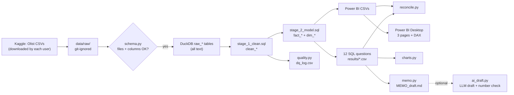

# E-commerce analytics: SQL + Power BI + decision memo

Twelve business questions about a public Brazilian marketplace dataset (Olist, about
100,000 orders), answered with DuckDB SQL, a three-page Power BI dashboard and a one-page
decision memo. One command rebuilds every number from the raw files, and a test suite
checks the definitions against hand-worked answers.

## 1. Demo

**Live demo:** [huggingface.co/spaces/sarahebbadj/ecommerce-analytics-powerbi](https://huggingface.co/spaces/sarahebbadj/ecommerce-analytics-powerbi) (no API key needed).

Demo video: pending — to be recorded by Sara.

Dashboard screenshots and PDF: pending (Sara builds the dashboard; see `docs/POWERBI_STEPS.md`).

> TODO (Sara): add `docs/screenshots/page1_sales.png` etc. and a short GIF here after the real run.

## 2. The problem

An online marketplace's operations and marketing teams need clear answers to everyday
questions: Are sales growing? Do customers come back? Where do deliveries arrive late, and
does that hurt reviews? Which categories carry heavy freight costs? The answers are only
useful if they are **correct and reproducible**: the same definitions in SQL, in the
dashboard and in the memo, with data-quality problems counted rather than hidden.

## 3. What it does

- **Loads and checks** the nine Olist CSV files into DuckDB, stopping with a clear message if a file or column is missing.
- **Cleans** types, duplicates, missing values and cancelled orders, and logs every rule's row count in a data-quality log (27 checks).
- **Answers 12 SQL questions** (`sql/questions/`): monthly revenue, repeat customers, top categories, late delivery by state, reviews vs lateness, freight share, cohort retention, seller ranking, payment types, basket size, review by days late, worst routes.
- **Exports a star schema** (3 fact tables, 5 dimensions) for Power BI, with documented DAX measures and click-by-click build steps.
- **Reconciles** totals computed different ways (by month, by category, from the exported files) so a double-counting join cannot slip through.
- **Fills a one-page memo template** with numbers computed from the results (three findings, three recommendations with what-if impact and stated assumptions, risks). Optional: an AI first draft whose numbers are machine-checked against the facts.

## 4. Architecture



Components and design decisions: `docs/architecture.md`. Tools: Python, DuckDB, pandas,
matplotlib, Power BI Desktop (DAX), pytest, ruff, GitHub Actions.

Key documents: [data dictionary](docs/data_dictionary.md) ·
[cleaning notes](docs/cleaning_notes.md) · [DAX measures](docs/measures.md) ·
[Power BI steps](docs/POWERBI_STEPS.md) · [memo template](memo/MEMO_TEMPLATE.md) ·
[walkthrough and interview questions](LEARN.md).

## 5. Results

**Real-data run: 8 October 2026, by the coding agent** (Sara has not reviewed it yet).
Command: `python -m olist_analytics.pipeline`. Data: Olist dataset, Kaggle version 2
(checksums in `data/README.md`): 99,441 orders loaded, purchased **September 2016 to
October 2018**; the full months are **January 2017 to August 2018** (September, October and
December 2016 and September and October 2018 are flagged partial in `q01`). Money is BRL;
"revenue" means item prices of delivered orders, excluding freight. Every number below is
in the file named next to it, under `outputs/`.

**Checks**

| What | Result | Denominator | Data | Evidence |
|---|---|---|---|---|
| Metric and cleaning tests with hand-worked answers | 50 passed, 0 failed | 50 tests | synthetic fixture (not real data) | `pytest` |
| Reconciliation (same total computed two ways) | 7 of 7 match | 7 totals | real Olist data | `reconciliation.csv` |
| Data-quality checks that found rows | 15 of 27 | 27 checks | real Olist data | `dq_log.csv` |
| AI memo draft, number check (`openai/gpt-6-luna`), current facts file | 3 of 3 drafts with 0 unsupported numbers | 3 drafts, US$0.0018879 in total | real memo facts (current `memo_facts.json`) | `evals/ai_draft/number_check.csv` (rows from 15:18 UTC) |
| Same check, first 3 drafts | 3 of 3 drafts with 0 unsupported numbers (also 0 when re-checked against the current facts file) | 3 drafts, US$0.0017598 in total | an earlier `memo_facts.json` from the same day (older data label) | `evals/ai_draft/number_check.csv` (rows from 12:35 UTC) |

**Key numbers**

| Area | Number | Denominator | File |
|---|---|---|---|
| Delivered orders, revenue | 96,478 delivered orders; BRL 13,221,498.11 revenue | 99,441 orders | `reconciliation.csv`, `results/q01_…` |
| Basket | mean order value BRL 137.04, median BRL 86.57; 9.99% of orders have 2+ items | 96,478 delivered orders | `results/q10_basket_size.csv` |
| Freight | BRL 2,198,275.64 = 16.63% of item value | 96,478 delivered orders | `results/q06_freight_share.csv` |
| Late deliveries | 6,534 late = 6.8% (8.1% if timestamps are compared instead of dates) | 96,470 delivered orders with usable dates | `results/q04_…`, `memo_facts.json` |
| Highest late rates (states with 100+ orders) | AL 21.41% (85 of 397), MA 17.43% (125 of 717), SE 15.22% (51 of 335) | per state | `results/q04_late_delivery_by_state.csv` |
| Reviews, on time vs late | 4.29 vs 2.27 stars (gap 2.02, 95% CI 1.98 to 2.06); 1–2 stars: 9.27% vs 62.42% | 89,443 on-time and 6,381 late orders with a review | `results/q05_…`, `memo_facts.json` |
| Reviews by days late | 1–3 days 3.29 (n=1,852); 4–7 days 2.10 (n=1,748); 8–14 days 1.67 (n=1,446); 15+ days 1.72 (n=1,335) | late orders with a review | `results/q11_review_by_delay_bucket.csv` |
| Review answered before the parcel arrived | 4,473 of 6,381 late orders (70.10%); 180 of 89,443 on-time orders (0.20%) | orders with a review | `results/q05_…`, `results/q11_…` |
| Repeat customers | 2,801 = 3.00%; 786 of them placed all orders on one day; came back on a later day: 2,015 = 2.16%, median 74 days later | 93,358 customers with a delivered order | `results/q02_repeat_customer_rate.csv` |
| Bought again in the month after the first order | 0.5% | 22 cohorts, weighted | `memo_facts.json` |
| Top 3 categories by revenue | health_beauty 9.33%, watches_gifts 8.82%, bed_bath_table 7.74% (25.9% together) | revenue of delivered orders | `results/q03_top_categories.csv` |
| Payment | credit card on 77.02% of orders (78.46% of value, 3.5 instalments on average); boleto 19.89% | 96,478 delivered orders (an order can use 2 types) | `results/q09_payment_types.csv` |

**What these numbers support, and what they do not** (coding agent's draft; Sara checks
and rewrites):

1. **Late orders get much lower reviews, and the score falls with the delay up to about two
   weeks** (4.29 on time, 3.29 at 1–3 days late, 1.67 at 8–14 days, 1.72 at 15+ days). The
   gap is far larger than sampling noise (95% CI 1.98 to 2.06 stars). It is an
   **association, not proof of cause**: late orders also differ in region, product and seller.
2. **Most late-order reviews were written before the parcel arrived.** Olist emails the
   survey when the parcel arrives or when the promised date is due, and 70.10% of late-order
   reviews were answered before delivery (98.58% for orders 15+ days late), so the gap
   partly measures "still waiting" rather than "arrived late". The
   1,908 late orders reviewed after delivery averaged 3.72 stars, against 4.29 for on-time
   orders; that smaller gap is not a clean "effect of lateness" either, because customers who
   wait to answer are a self-selected group.
3. **The highest late rates are in north-eastern states** (AL, MA, SE, PI and CE, among
   states with 100+ orders), against 4.49% for SP, the largest state. In absolute numbers,
   most late orders are still in the big south-eastern states: SP 1,820 and RJ 1,495 of the
   6,534 (`q04`). The memo's what-if (if those 5 states had the national rate: about 286
   fewer late orders) assumes the volume stays the same.
4. **Very few customers return**: 3.00% placed a second delivered order, and only 2.16% came
   back on a later day; 786 of the 2,801 "repeat" customers had split one basket into
   several same-day orders. Counting by `customer_id` would show 0.00%.
5. **Revenue is spread across many categories** (top 3 = 25.9%), and freight adds 16.63%
   on top of item value overall, up to 36.5% in christmas_supplies among categories with
   100+ orders (`q06`, `memo_facts.json`). The data has no product costs, so this says
   nothing about margin.

> TODO (Sara): after the real run, add a table of the three headline numbers here, each
> with its denominator, the run date and the file it comes from in `outputs/results/`.

## 6. What failed and what I changed

During the first build (coding agent, synthetic fixture):

- **A hand-worked test answer was wrong, and the test caught it.** The expected review
  ranking for "categories with at least 2 orders" left out `computers_accessories`, which
  does have 2 delivered orders. The SQL was right; the expectation was fixed.
- **The cohort chart treated "not observable yet" as 0%.** A cohort from the last month of
  data cannot have a "3 months later" value. The chart now leaves those cells blank and
  shows 0 only when the month was observed and nobody returned.
- **Counts came out as decimals (`3.0`)** because `SUM` of integer flags returns a very large
  integer type that pandas turns into floats. Counts now use `COUNT(*) FILTER (WHERE ...)`.

On the real data (coding agent, 8 October 2026). The schema check passed first time: the
real column names matched the loader, so no loader change was needed. The first run's
outputs are kept in `outputs/first_run_before_fixes/` as evidence.

- **A data-quality check over-counted 158-fold.** "Products whose category has no English
  name" was 2,058 because the check compared the English and Portuguese names, and some names
  are the same in both languages (`pet_shop`, `cool_stuff`). The real number is 13 (two
  categories). Fixed with an explicit `has_english_name` flag; a regression test adds a
  `pc_gamer -> pc_gamer` translation to the fixture database and expects 0.
- **"Repeat customers" included split baskets.** 786 of 2,801 repeat customers placed all
  their orders on the same day, which pulled the median "days to the second order" down to
  29. `q02` now also reports customers who came back on a later day (2.16%, median 74 days),
  and the memo's suggested timing for a second-order offer uses 74, not 29. Test added.
- **The review gap mixes "late" with "not arrived yet".** My first version of this check
  compared `review_creation_date` with the delivery date, but in this data that column
  behaves like the day the survey was *sent* (almost always midnight, and the answer timestamp is
  never earlier), so it now uses `review_answer_timestamp`, when the customer actually
  rated the order. 70.10% of late-order reviews were answered before delivery. Reported in
  `q05`, `q11` and the memo's risks. Test added.
- **Month-on-month growth of +1,025,573%** for January 2017, measured against a December
  2016 with a single order. Growth is now left empty next to a partial month (`q01`).
- **The cohort chart again showed fake 0% cells**, this time for September and October 2018:
  those months exist in the data but contain only cancelled stragglers. The chart now cuts
  at the last full month (August 2018). Test added.
- **Definition check:** comparing delivery timestamps instead of dates would make 1,292 more
  orders late (8.1% instead of 6.8%). The date rule stays; both numbers are reported.

> TODO (Sara): add what you found and changed after running on the real data (for example
> a data-quality problem, a definition you changed, or a threshold you adjusted, and why).

## 7. How to run

Needs Python 3.11+ and [uv](https://docs.astral.sh/uv/) (or see the pip alternative below).

```bash
uv sync --extra dev                                     # 1. create .venv and install
uv run pytest                                           # 2. tests on the synthetic fixture
uv run python -m olist_analytics.pipeline --demo        # 3. every output, no download needed
uv run python -m olist_analytics.pipeline               # 4. real run, after data/README.md steps
uv run python -m olist_analytics.ai_draft --model cheap # 5. optional AI first draft (needs key)
```

Without uv: `python -m venv .venv`, activate it (Windows: `.venv\Scripts\activate`), then
`pip install -e ".[dev]"` and run the same commands without `uv run`.

## 8. Data and licence

- **Data:** Brazilian E-Commerce Public Dataset by Olist, Kaggle version 2
  (https://www.kaggle.com/datasets/olistbr/brazilian-ecommerce). Licence as Kaggle lists it:
  **CC BY-NC-SA 4.0** (https://creativecommons.org/licenses/by-nc-sa/4.0/), read from
  Kaggle's dataset API on 8 October 2026 (details and file checksums in `data/README.md`).
  The raw data is **not** in this repository and is never re-uploaded; each user downloads
  it. Row-level outputs and the `.pbix` file are git-ignored for the same reason.
- **Derived outputs** (`outputs/`: aggregated result tables, data-quality counts, charts,
  memo numbers) are derived from the Olist data and are shared under the same licence,
  **CC BY-NC-SA 4.0** (non-commercial, credit to Olist), not under the MIT licence.
- **Tests** use a small **synthetic** fixture (`tests/fixtures/olist_synthetic/`) with the
  same file layout, invented by hand. It contains no real data.
- **Code:** MIT licence (`LICENSE`), copyright Sara Hebbadj. It covers the code only.

## 9. How I used AI agents

> DRAFT for Sara: check every sentence and edit it before publishing.

- **Brief and acceptance tests:** I wrote the brief and acceptance
  tests in the project's build spec: the 10 SQL questions, the 3 dashboard pages, the
  one-page memo and the data-rights rules.
- **First version:** a coding agent (Claude, by Anthropic) generated the first version of
  the code, SQL, tests, synthetic fixture and documentation on 8 October 2026. It had no
  access to the real data, so it built against the published Olist file layout and a
  hand-made synthetic fixture.
- **First real-data run:** later the same day a coding agent downloaded the Olist data,
  ran the pipeline, fixed the problems listed in section 6, ran the optional AI draft three
  times with `openai/gpt-6-luna` (US$0.0017598 in total) and wrote the numbers in section 5.
  Those 3 drafts were made from an earlier `memo_facts.json` (older data label), so a coding
  agent ran the draft 3 more times on the current facts file (US$0.0018879 in total).
- **My part (to complete before publishing):** re-run the pipeline on my computer, review
  every SQL file, definition and number, build the Power BI dashboard myself, and write the
  memo's conclusions and recommendations.
- **AI inside the project (optional):** `ai_draft.py` asks a model for a first draft of the
  memo from the computed numbers only, and a checker flags any number the model invented.
  I rewrite the draft; the final `MEMO.md` is mine.

> TODO (Sara): list what you changed after reviewing.

## 10. Limitations and next steps

- **Correlation, not causation.** Late orders may differ in product, region or seller. The
  confidence interval for the review gap covers sampling noise only. A carrier or A/B test
  would be needed to measure cause and effect.
- **Review timing.** 70.10% of late-order reviews were answered before the parcel arrived,
  so the review gap partly measures "still waiting" rather than "arrived late"; the
  after-delivery subgroup is self-selected, so it does not isolate the effect either.
- **Definitions move the numbers:** late by date 6.8% vs by timestamp 8.1%; repeat rate
  3.00% with same-day split orders vs 2.16% without.
- **No costs:** revenue means item prices (BRL); nothing here is about profit or margin.
- **One historical marketplace** (Brazil, orders from September 2016 to October 2018, full
  months January 2017 to August 2018); patterns need checking before they are applied to
  another shop.
- **Thresholds are judgement calls** (e.g. a state needs 100 orders to be called "worst");
  they are in `src/olist_analytics/config.py`.
- **Multi-seller orders:** lateness and reviews are order-level, so they are shared by every
  seller in the order.
- **Next:** build and publish the dashboard (PDF + `.pbit`), record the walkthrough, and add
  a seller-level drill-down page.
