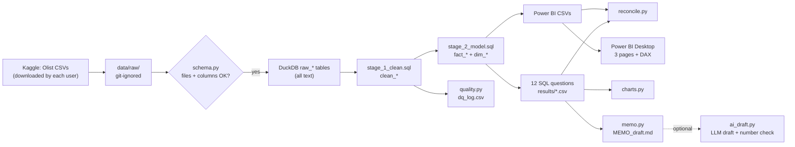

# E-commerce analytics: SQL + Power BI + decision memo

Twelve business questions about a public Brazilian marketplace dataset (Olist, about
100,000 orders), answered with DuckDB SQL, a three-page Power BI dashboard and a one-page
decision memo. One command rebuilds every number from the raw files, and a test suite
checks the definitions against hand-worked answers.

## 1. Demo

Demo video/Space: pending — to be recorded by Sara.

Dashboard screenshots and PDF: pending (Sara builds the dashboard; see `docs/POWERBI_STEPS.md`).

> TODO (Sara): add `docs/screenshots/page1_sales.png` etc. and a short GIF here after the real run.

## 2. The problem

An online marketplace's operations and marketing teams need clear answers to everyday
questions: Are sales growing? Do customers come back? Where do deliveries arrive late, and
does that hurt reviews? Which categories carry heavy freight costs? The answers are only
useful if they are **correct and reproducible**: the same definitions in SQL, in the
dashboard and in the memo, with data-quality problems counted rather than hidden.

## 3. What it does

- **Loads and checks** the nine Olist CSV files into DuckDB, stopping with a clear message if a file or column is missing.
- **Cleans** types, duplicates, missing values and cancelled orders, and logs every rule's row count in a data-quality log (26 checks).
- **Answers 12 SQL questions** (`sql/questions/`): monthly revenue, repeat customers, top categories, late delivery by state, reviews vs lateness, freight share, cohort retention, seller ranking, payment types, basket size, review by days late, worst routes.
- **Exports a star schema** (3 fact tables, 5 dimensions) for Power BI, with documented DAX measures and click-by-click build steps.
- **Reconciles** totals computed different ways (by month, by category, from the exported files) so a double-counting join cannot slip through.
- **Fills a one-page memo template** with numbers computed from the results (three findings, three recommendations with what-if impact and stated assumptions, risks). Optional: an AI first draft whose numbers are machine-checked against the facts.

## 4. Architecture



Components and design decisions: `docs/architecture.md`. Tools: Python, DuckDB, pandas,
matplotlib, Power BI Desktop (DAX), pytest, ruff, GitHub Actions.

Key documents: [data dictionary](docs/data_dictionary.md) ·
[cleaning notes](docs/cleaning_notes.md) · [DAX measures](docs/measures.md) ·
[Power BI steps](docs/POWERBI_STEPS.md) · [memo template](memo/MEMO_TEMPLATE.md) ·
[walkthrough and interview questions](LEARN.md).

## 5. Results

**Measured so far (8 October 2026, by the coding agent):**

| What | Result | Denominator | Data | Command |
|---|---|---|---|---|
| Metric and cleaning tests with hand-worked answers | 46 passed, 0 failed | 46 tests | synthetic fixture (not real data) | `pytest` |
| Reconciliation (same total two ways) | 7 of 7 match | 7 checks | synthetic fixture | `python -m olist_analytics.pipeline --demo` |
| AI memo draft, number check (dry run) | 0 unsupported numbers | 1 draft | synthetic facts, **fake client: proves plumbing only** | `python -m olist_analytics.ai_draft --dry-run --facts outputs/synthetic_demo/memo_facts.json` |

**Pending:**

| What | Status |
|---|---|
| Findings on the real Olist data (12 SQL answers, data-quality counts, reconciliation) | pending: Sara downloads the data (`data/README.md`) and runs `python -m olist_analytics.pipeline` |
| Power BI cards match SQL totals | pending: Sara builds the dashboard |
| AI memo draft, number check on a real model | pending live run (needs OpenRouter key) |

> TODO (Sara): after the real run, add a table of the three headline numbers here, each
> with its denominator, the run date and the file it comes from in `outputs/results/`.

## 6. What failed and what I changed

During the first build (coding agent, synthetic fixture):

- **A hand-worked test answer was wrong, and the test caught it.** The expected review
  ranking for "categories with at least 2 orders" left out `computers_accessories`, which
  does have 2 delivered orders. The SQL was right; the expectation was fixed.
- **The cohort chart treated "not observable yet" as 0%.** A cohort from the last month of
  data cannot have a "3 months later" value. The chart now leaves those cells blank and
  shows 0 only when the month was observed and nobody returned.
- **Counts came out as decimals (`3.0`)** because `SUM` of integer flags returns a very large
  integer type that pandas turns into floats. Counts now use `COUNT(*) FILTER (WHERE ...)`.

> TODO (Sara): add what you found and changed after running on the real data (for example
> a data-quality problem, a definition you changed, or a threshold you adjusted, and why).

## 7. How to run

Needs Python 3.11+ and [uv](https://docs.astral.sh/uv/) (or see the pip alternative below).

```bash
uv sync --extra dev                                     # 1. create .venv and install
uv run pytest                                           # 2. tests on the synthetic fixture
uv run python -m olist_analytics.pipeline --demo        # 3. every output, no download needed
uv run python -m olist_analytics.pipeline               # 4. real run, after data/README.md steps
uv run python -m olist_analytics.ai_draft --model cheap # 5. optional AI first draft (needs key)
```

Without uv: `python -m venv .venv`, activate it (Windows: `.venv\Scripts\activate`), then
`pip install -e ".[dev]"` and run the same commands without `uv run`.

## 8. Data and licence

- **Data:** Brazilian E-Commerce Public Dataset by Olist, Kaggle
  (https://www.kaggle.com/datasets/olistbr/brazilian-ecommerce). Licence: commonly listed
  as CC BY-NC-SA 4.0 — **to verify on the Kaggle page** (see `data/README.md`).
  The raw data is **not** in this repository and is never re-uploaded; each user downloads
  it. Row-level outputs and the `.pbix` file are git-ignored for the same reason.
- **Tests** use a small **synthetic** fixture (`tests/fixtures/olist_synthetic/`) with the
  same file layout, invented by hand. It contains no real data.
- **Code:** MIT licence (`LICENSE`), copyright Sara Hebbadj.

## 9. How I used AI agents

> DRAFT for Sara: check every sentence and edit it before publishing.

- **Brief and acceptance tests:** I wrote the brief and acceptance
  tests in the project's build spec: the 10 SQL questions, the 3 dashboard pages, the
  one-page memo and the data-rights rules.
- **First version:** a coding agent (Claude, by Anthropic) generated the first version of
  the code, SQL, tests, synthetic fixture and documentation on 8 October 2026. It had no
  access to the real data, so it built against the published Olist file layout and a
  hand-made synthetic fixture.
- **My part (to complete before publishing):** download the data, run the pipeline, review
  every SQL file and definition, build the Power BI dashboard myself, and write the memo's
  conclusions and recommendations.
- **AI inside the project (optional):** `ai_draft.py` asks a model for a first draft of the
  memo from the computed numbers only, and a checker flags any number the model invented.
  I rewrite the draft; the final `MEMO.md` is mine.

> TODO (Sara): list what you changed after reviewing.

## 10. Limitations and next steps

- **Correlation, not causation.** Late orders may differ in product, region or seller. The
  confidence interval for the review gap covers sampling noise only. A carrier or A/B test
  would be needed to measure cause and effect.
- **No costs:** revenue means item prices (BRL); nothing here is about profit or margin.
- **One historical marketplace** (Brazil, 2016–2018); patterns need checking before they are
  applied to another shop.
- **Thresholds are judgement calls** (e.g. a state needs 100 orders to be called "worst");
  they are in `src/olist_analytics/config.py`.
- **Multi-seller orders:** lateness and reviews are order-level, so they are shared by every
  seller in the order.
- **Next:** build and publish the dashboard (PDF + `.pbit`), record the walkthrough, run the
  live AI draft once, and add a seller-level drill-down page.
