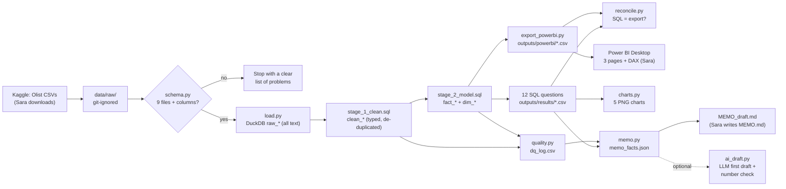

# Architecture

## Components

| Step | File | What it does |
|---|---|---|
| Schema check | `src/olist_analytics/schema.py` | Lists the 9 expected files and their columns; accepts the original `lenght` spelling and a byte-order mark. |
| Load | `src/olist_analytics/load.py` | Finds the CSV folder (or extracts the Kaggle zip) and loads each file into DuckDB as text. |
| Clean | `sql/stage_1_clean.sql` | Casts types, removes duplicates, keeps the latest review, pads zip codes, translates categories. |
| Model | `sql/stage_2_model.sql` | Builds `fact_orders`, `fact_order_items`, `fact_payments` and the dimensions. Children are aggregated per order before joining. |
| Data quality | `src/olist_analytics/quality.py` | 26 checks; each counts the rows a rule touched → `outputs/dq_log.csv`. |
| Questions | `sql/questions/q01…q12.sql`, `analysis.py` | One business question per file, answers saved as CSV. |
| Power BI export | `export_powerbi.py` | Writes the model tables as CSV for Power BI (row-level, git-ignored). |
| Reconciliation | `reconcile.py` | The same totals computed two ways must match (catches join fan-out). |
| Charts | `charts.py` | Five matplotlib charts for the README and memo. |
| Memo | `memo.py`, `memo/MEMO_TEMPLATE.md` | Computes every memo number from the results and fills the template. |
| Optional AI draft | `ai_draft.py`, `llm_client.py` | A model drafts the memo from the facts; a checker flags any number not in the facts. |
| Orchestration | `pipeline.py` | One command runs all steps; `--demo` uses the synthetic fixture. |

## Tools

Python 3.11+, DuckDB (SQL engine in a single file, no server), pandas, matplotlib,
Power BI Desktop (DAX), pytest, ruff, GitHub Actions. The optional AI draft uses the
OpenAI-compatible SDK against OpenRouter.

## Why DuckDB?

It runs SQL directly on CSV files with no database server to install, it is fast on
~100k orders on a laptop, and its SQL (window functions, `QUALIFY`, `FILTER`, `ROLLUP`)
is close to what is used in Snowflake, BigQuery and Postgres.
